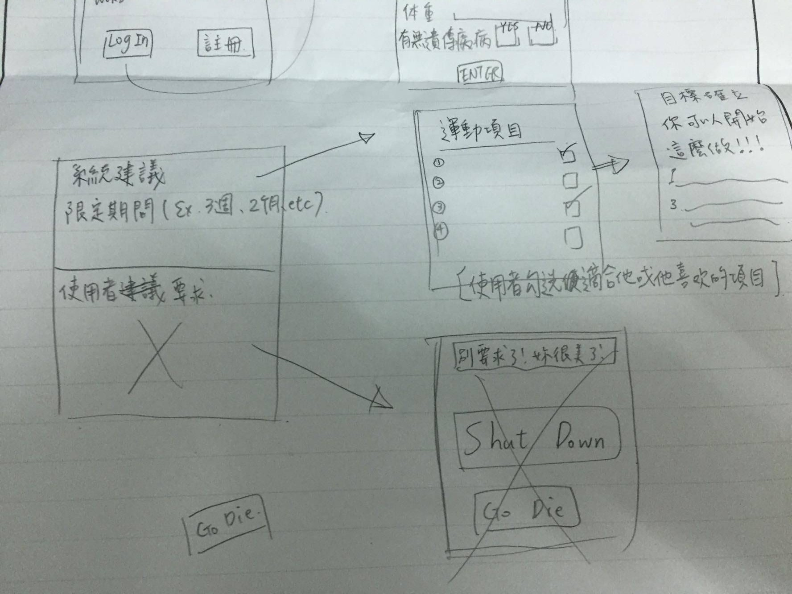

組長：資管3B 0324048 張曜文
 資管3B 0324016 黃俊諺 
資管3B 0324032 陳雨晴
 
 
工作分配
 組長 - 0324048 張曜文：參與討論、工作分配、草圖重畫、上傳GitHub 
0324016 黃俊諺：參與討論、圖片繪製、上傳GitHub 
0324032 陳雨晴：參與討論、使用者介面設計、繪製草圖 

<h1>一.文字敘述+圖形介面</h1>
  

  
<h1>二.使用者個案圖+活動圖</h1>
  
<h1>三.強韌分析圖</h1>
  
  
  
<h1>四.循序圖</h1>
  
<h1>四.類別圖</h1>
  
